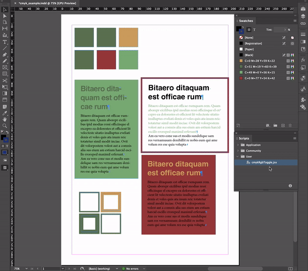

# InDesign CMYK-RGB Toggle

Sometimes you need a fast way of switching color modes in InDesign, and have some control on the color mapping. I couln't find a faster way to map and switch all colors CMYK <--> RGB than doing it manually through Color Swatches panel. So I wrote a small script that implements this.

[]

## Considerations
- This script does not perform mapping automatically. You need to input the color values for each color in `_colorMapping` array (`[[CMYK-value], [RGB-value]]`).
- It follows naming convention: `R=Value G=Value B=Value` and `C=value M=value Y=value K=value`.
- It does not consider color swatch duplicates.
- If color does not exist in `_colorMapping` it leaves it as is, changing all other colors that are.

## How to use
Copy `CmykRgbToggle.jsx` in Scripts path. 
- __Scripts panel__: `InDesign > Window > Utilities > Scripts`.
- __Scripts path__: from `scripts panel` burger menu, click on `Reveal in Finder`. I'm guessing for Windows users you'll have an option there that allows you to open the corresponding path.

Once you've copied it in the corresponding path you should see it in `Scripts panel > User`. Double-click to run it.

- __Color swatches__: `InDesign > Window > Color > Swatches`. You can track color changes there.